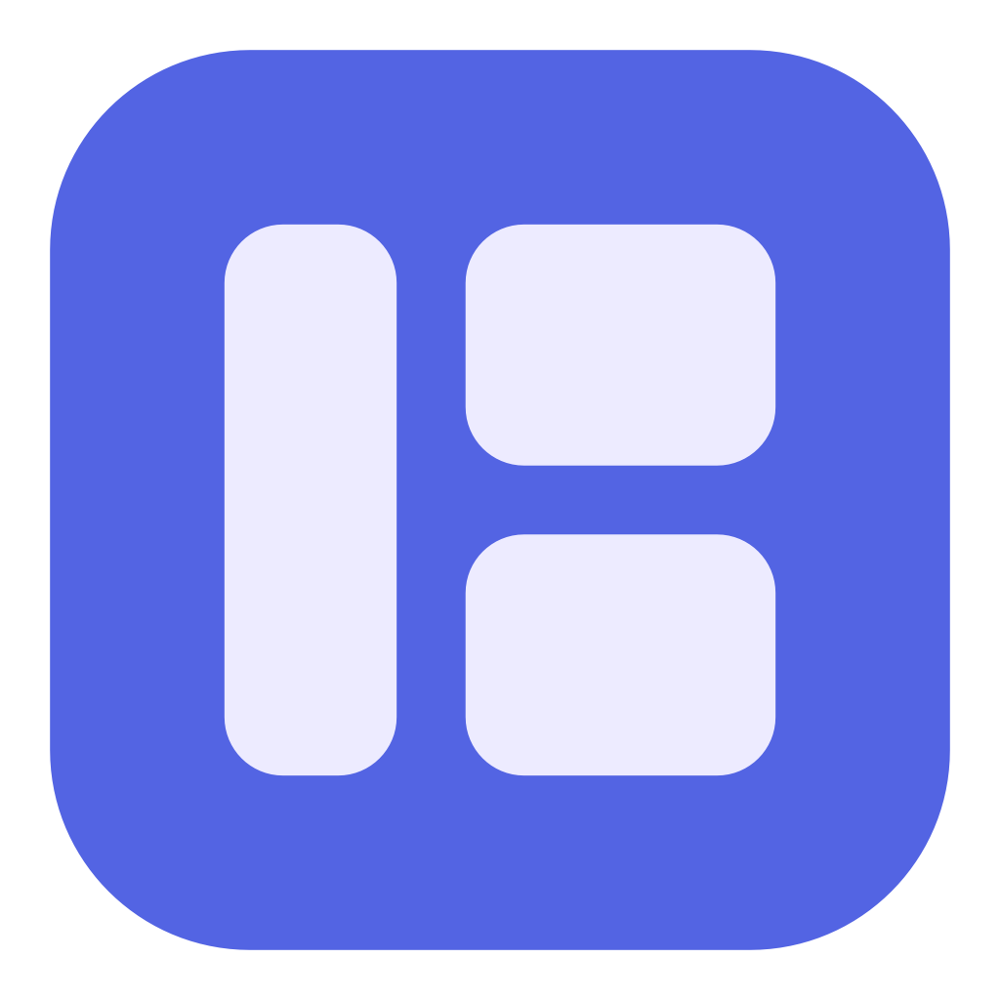
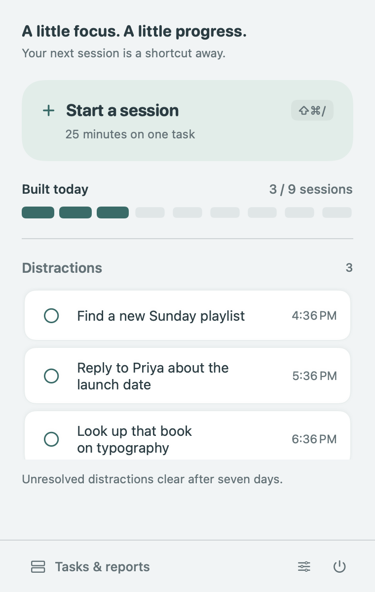
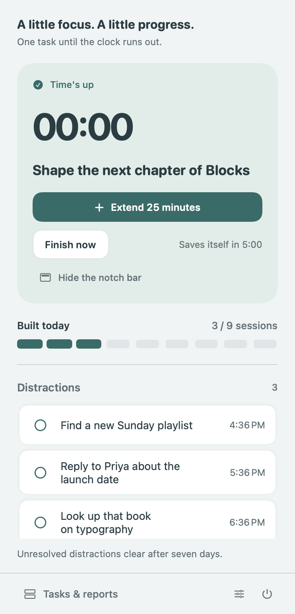
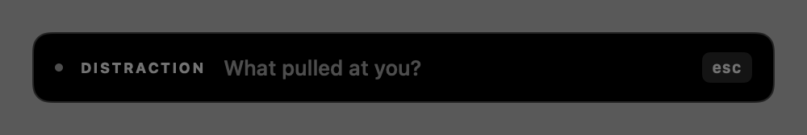
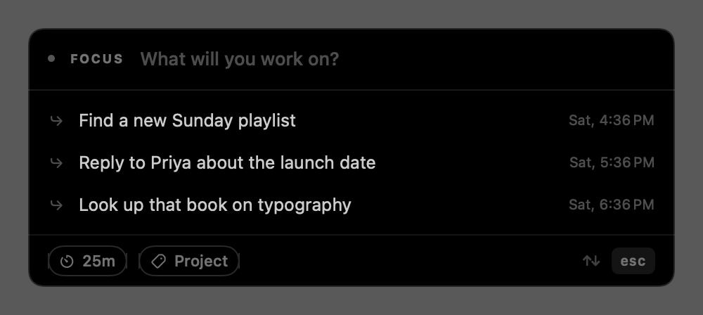
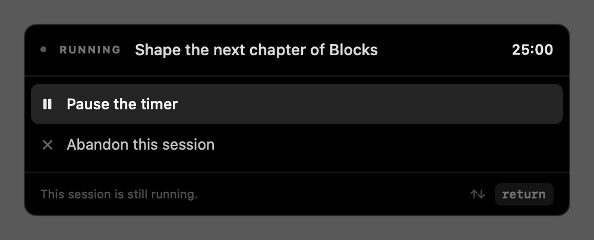
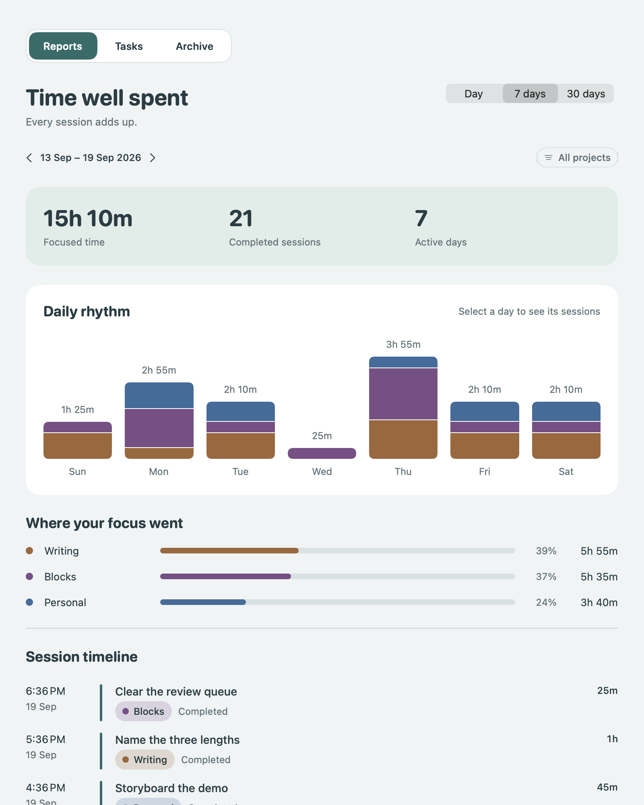

<div align="center">



# Blocks

**The keyboard-first focus buddy for macOS.**
Start a session, write down whatever pulls at you, and keep showing up — without leaving the keyboard.

No blocking · no monitoring · no accounts · no network · no TCC permissions

<br>


&nbsp;&nbsp;


</div>

## How it works

- **Never touch the mouse.** ⇧⌘/ starts a session from any app, ⌘/ captures a distraction, ⇧⌘E adds time when the clock runs out. Every step of a session is a keystroke.
- **One length, set once.** Sessions are 25 minutes. Change that in Settings and the new number is the default from then on. The start strip states it on a chip you can ignore, and changing it there is for that session only.
- **One task, one session.** A task is the work you sat down to do, not a folder that collects attempts. Needing longer extends the session you are in rather than starting another.
- **Finish quietly, or keep going.** At zero, Blocks offers 25 more minutes for five minutes and saves itself if you say nothing. No window, no sound, no focus stolen.
- **See where time went.** Day, seven-day, and thirty-day reports show focused time, project breakdowns, and a session timeline.
- **Capture, don’t chase.** Write a distraction down instead of acting on it; the list clears itself after seven days.

## Install

Requires macOS 14+ and Apple's Command Line Tools (`xcode-select --install`). No Xcode, no developer account.

```sh
./build.sh
```

Builds a release binary, renders the icon, assembles and self-signs `dist/Blocks.app`, installs it to `/Applications`, and launches it.

The first build creates a **Blocks Local Code Signing** identity in your login keychain, so macOS may ask you to authenticate — a keychain dialog, not an Accessibility grant. Later builds reuse it; ad-hoc signing is never used. Set `BLOCKS_SIGNING_IDENTITY` to use a certificate you already have, or pass `--no-install` to build the bundle without installing it.

Quit any running instance before rebuilding.

Upgrading from **Park**: quit it first, and Blocks copies `~/Library/Application Support/Park/` across on first launch, leaving the original as a backup. Existing Blocks data is never overwritten.

## Daily use

| Shortcut | Does |
| --- | --- |
| `⌘/` | Capture a distraction — over any app or fullscreen window, field already focused |
| `⇧⌘/` | Start a block; during one, pause or abandon it |
| `↑` `↓` `↩` | Pick a captured distraction to work on, in the start strip |
| `⇧⌘E` | Extend a finished session by 25 minutes, for five minutes after it ends |
| `⌘,` | Settings — session length, daily target, all three shortcuts |
| `⌘1` `⌘2` `⌘3` | Reports / Tasks / Archive, in the review window |

<div align="center">

</div>

Capture is a black strip under the notch, the width of a sentence and one line tall: the label, the field, and the one key that is live. Type, press Return, and you are back in the app you were in. It is the only thing you can write down mid-session: nothing can be lined up behind a running session, because that is a way of stopping.

<div align="center">

</div>

<div align="center">

</div>

Press the same shortcut while a session is running and the strip asks about *that* session instead: it names it, shows the time left, and offers two answers — **Pause the timer**, which just stops the clock and asks for nothing, and **Abandon this session**, which opens one optional field. Type a reason or press Return again and it ends with none. ↑↓ to move, Return to take, Escape to back out. Starting something else is not on the list: abandon first, and the same shortcut opens the start strip from idle.

Starting is the same strip, one line taller. Type what the session is for and press Return and nothing else is in the way. Underneath, the distractions you captured along the way are offered as rows: they filter as you type, ↑↓ arrows them, and starting one takes it off the live list into the archive — acting on a written-down thought is the other way of being finished with it. The footer carries two answers you can ignore: the session length, which states the default from Settings and can be changed for this session only, and the project, which offers the ones you used most recently and borrows the field itself to name a new one.

The remaining time sits in the menu bar, or in a black bar that grows out of the notch — whichever you choose in Settings, never both at once. The bar holds the clock with a pause/play button, and closing it hands the clock back to the menu bar; the menu can call it up again mid-session. The last 30 seconds turn orange silently. **Pause…** in the menu is the other kind: a typed reason, one per session, and a second stop resets it. **Abandon…** ends a session early and preserves its focused time.

When the clock reaches zero the menu bar reads **Done** and the session is held, unwritten, for five minutes: **Extend 25 minutes** (⇧⌘E) adds time to that same session, **Finish now** files it immediately, and ignoring it files it when the five minutes are up. Nothing is charged while the offer stands, and starting a new session or quitting files it too.

Every session runs for the default length in Settings; a one-off different length means changing that default first, which is a deliberate trip rather than a question in the way of starting. Each session belongs to one task of its own — there is no "focus again". Marking a task done is separate from completing its session. Retagging a task moves its recorded sessions in reports — that is how a history gets organised after the fact — while the session record on disk keeps the tag it was written with.

Captured distractions clear into the archive after seven days, and can be restored from there with a fresh week.

**Reports** supports date navigation, project filters, clickable project totals, and clickable daily bars. Totals include partial sessions and exclude paused time. Sessions are grouped by their end date. Older completed records use planned duration; older partial records estimate duration from timestamps and pauses because those builds did not record charged time.

<div align="center">

</div>

Sleep suspends elapsed time without spending your pause. Quitting or crashing preserves the remaining time — time while Blocks was gone is never charged.

## Your data

Everything is local, in `~/Library/Application Support/Blocks/`:

| File | Holds |
| --- | --- |
| `state.json` | Live checkpoint — current phase, tasks, project tags, session length, pending writes |
| `blocks.jsonl` | One record per completed, abandoned, or reset block |
| `parking.jsonl` | Distraction events — resolved, expired, restored. The file keeps its original name so existing records stay readable |
| `intents.jsonl` | Retired. Queue events from the builds that had a queue; never written again |

Append-only, ISO 8601 UTC, deduplicated by ID so a crash mid-write loses nothing. Unreadable data is preserved and reported rather than silently replaced; a save failure suspends progress and shows an error. Back this folder up before repairing anything by hand.

## Development

```sh
./test.sh            # Foundation-only core checks (no XCTest needed)
./scripts/smoke.sh   # app persistence and session-length checks
./scripts/preview.sh # regenerate the screenshots in Resources/Previews
```

| Path | |
| --- | --- |
| [Sources/BlocksCore/](Sources/BlocksCore/) | Models and storage — the pure, tested core |
| [Sources/Blocks/](Sources/Blocks/) | SwiftUI surfaces, overlays, hotkeys, brand |
| [SPEC.md](SPEC.md) | What the app does, in full |
| [CONTEXT.md](CONTEXT.md) | The vocabulary it's built on |
| [docs/design/](docs/design/README.md) · [docs/adr/](docs/adr/) | Visual system · decisions and their costs |

The notch timer, the menu bar clock, and multi-display behavior need a visual pass on real hardware; the core checks can't establish them. SPEC.md carries the acceptance script.

## Branding

Three rounded bricks form a compact **B**, drawn once in [Sources/Blocks/Brand.swift](Sources/Blocks/Brand.swift) and used in two places: the menu bar template image, which adapts to its background, and the application icon that `build.sh` renders from the same source. The app's own surfaces carry no logo — they lead with your intent instead. Bundle identifier `local.blocks.focus`.
