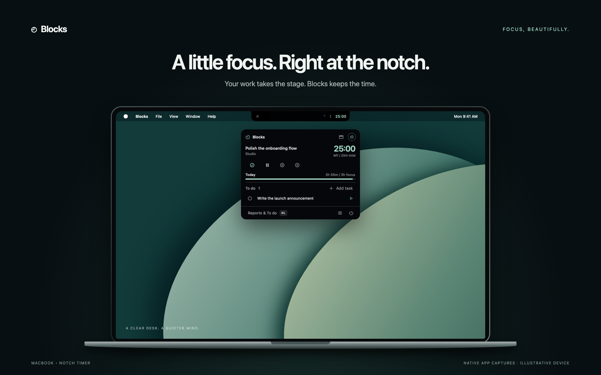
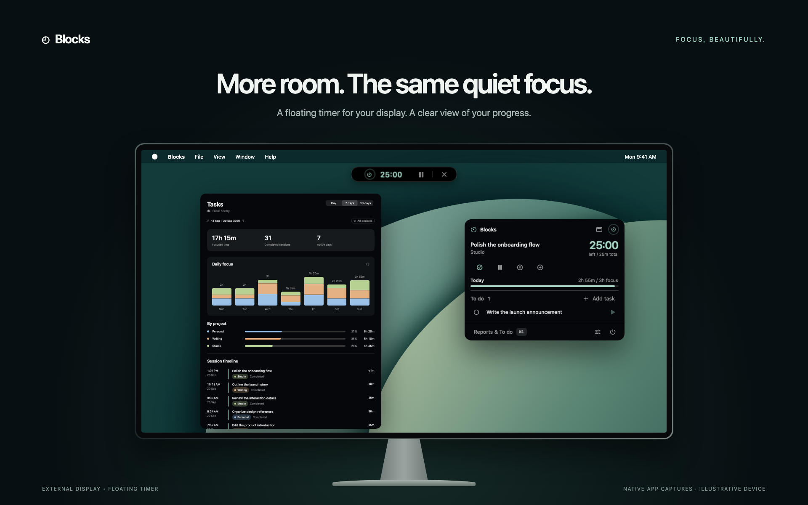
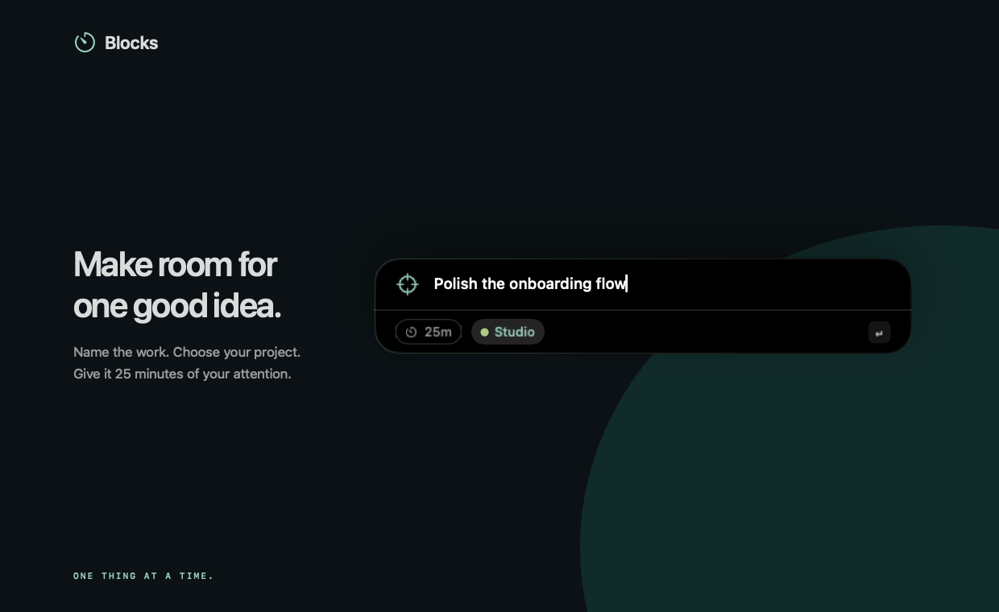
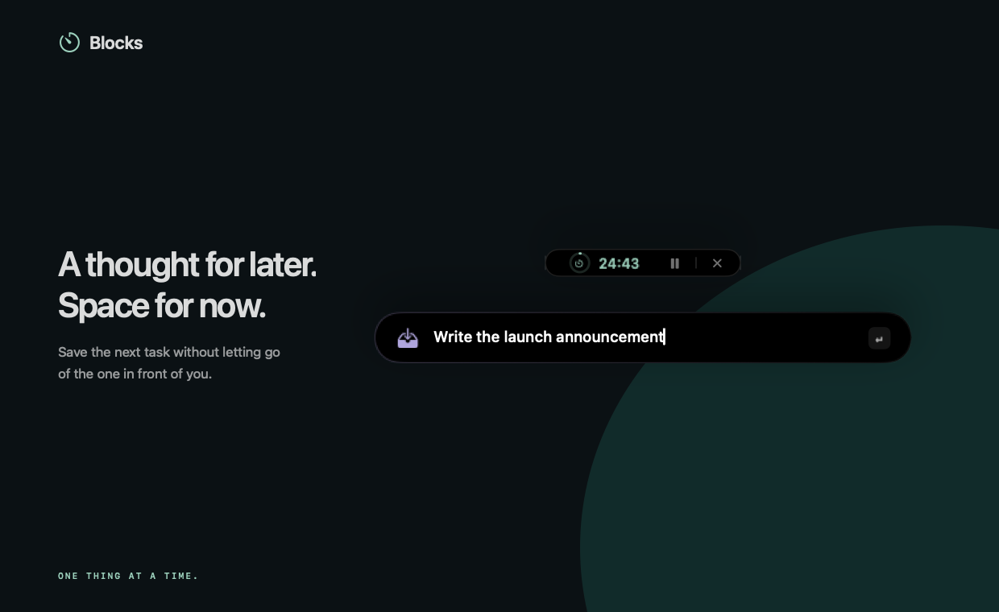
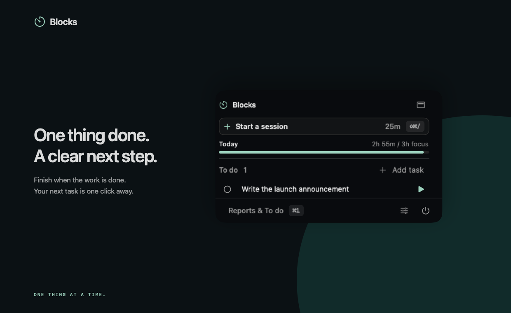
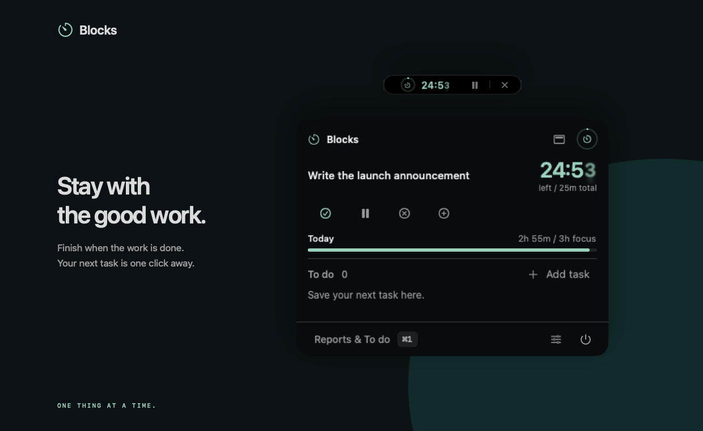
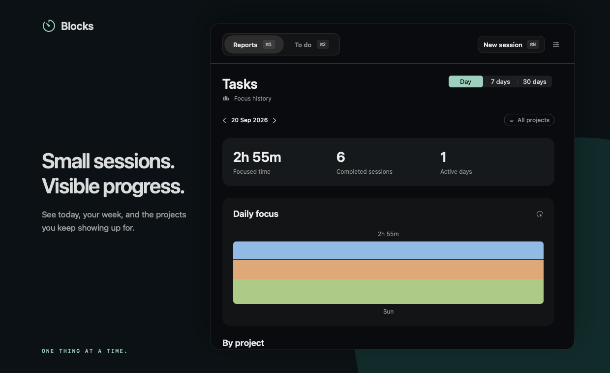
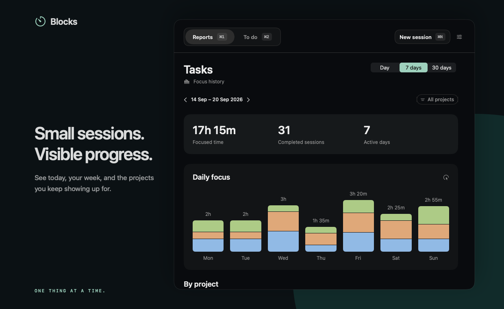
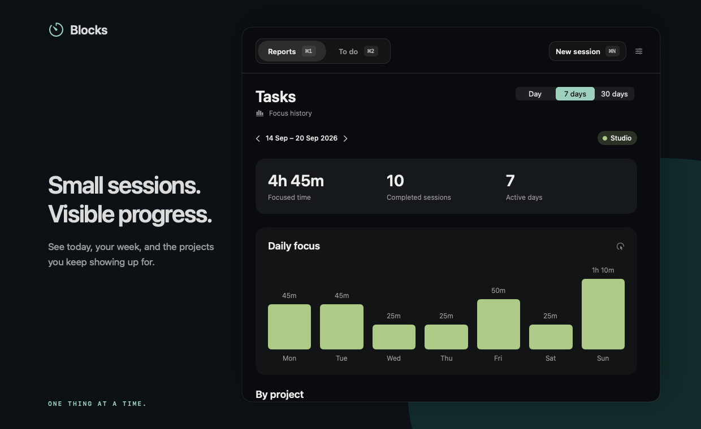

<div align="center">


# Blocks

**One thing at a time. Beautifully.**

The keyboard-first focus buddy for macOS. Name the work, queue what’s next, and see your progress.

No blocking · no monitoring · no accounts · no network · no TCC permissions



[Explore the screenshots](showcase/README.md) · [View the contact sheet](showcase/contact-sheet.jpg) · [Watch the walkthrough](showcase/video/blocks-walkthrough.mp4)

</div>

## Focus, without the ceremony

- **Start from anywhere.** Press `⇧⌘/`, name your task, choose a project, and hit Return. Or use `↑` / `↓` to choose a queued task.
- **Keep the next thought out of your way.** Press `⌘/`, type a task for later, and hit Return. Your current timer keeps running.
- **Finish when the work is done.** Click the timer popup’s checkmark to mark the task complete and save the time you actually focused. Start the queued task when you’re ready.
- **Set your own rhythm.** Sessions default to 25 minutes. Choose 1–180 minutes in Settings or override the length for one session. Pause, resume, or add 25 minutes without starting over.
- **Keep time where it belongs.** Use the MacBook notch, a floating timer on an external display, or the menu bar.
- **See the work add up.** Explore daily, seven-day, and thirty-day reports, project breakdowns, and the sessions behind them. Partial sessions count too.

## At home on every display

On a MacBook with a notch, the timer sits beside the camera cutout. Click it to open the full timer popup; use the play/pause button to hold or resume the clock.



On a display without a notch, Blocks uses a compact floating timer with a progress ring and countdown. It starts at the top center; drag the ring or countdown to place it anywhere on that screen. Blocks remembers the position for each display.

With **Notch bar** selected, the bar stays visible between sessions and shows **Ready**. Clicking it opens the start popup. Showing the bar hides the menu item; closing it brings the menu item back for that session.

*Device frames and wallpaper are illustrative. The app surfaces are native captures with sample data; see the [capture notes](showcase/README.md) for details.*

## From one good intention to the next

### 1. Name the work



Press `⇧⌘/`, type **Polish the onboarding flow**, and choose **Studio**. Return starts the session. The duration and project chips keep the two decisions that matter close to the task; a one-session duration override leaves your default unchanged.

### 2. Save the next thought



Something else comes to mind. Press `⌘/`, type **Write the launch announcement**, and press Return. It goes into **To do**, ready for later, while the current timer keeps running. You can also mark a queued task done without starting a timer.

### 3. Finish, then move forward



Done before the timer reaches zero? Open the timer popup and click **Mark task complete**. Blocks marks the task done, saves the session immediately, and records only the time you actually focused.



Click the play button beside the queued task to begin its session. The task leaves the queue, and the new timer starts. There is no need to type it again.

### Stay with the session, or let it finish quietly

Press `⇧⌘/` during a running or paused session to open its controls. Use `↑` / `↓` and Return to pause/resume, extend by 25 minutes, toggle the notch bar, or abandon with an optional reason. To switch work before the timer ends, complete the current task or abandon its session first.

Pausing from the strip or timer bar simply holds the clock. The popup’s reasoned pause action records why you stopped: one reasoned pause is allowed per session, and a second resets it. Sleep suspends elapsed time without spending that pause. Quitting or crashing preserves remaining time; time while Blocks is closed is not charged.

At zero, Blocks offers **25 more minutes** for five minutes. **Extend** continues the same session; **Finish now** saves it immediately. Ignoring the offer saves automatically, without a sound, a window taking focus, or a forced break. The offer itself does not charge focus time. Starting another session also saves the finished one.

## See where your attention went

Open **Reports & To do** from the timer popup. **Reports** (`⌘1`) shows focus history; **To do** (`⌘2`) has an add field, an Up next list with Start actions, and completed queued tasks you can reopen.

### Your day



Choose **Day** for today’s focused time, completed sessions, and project breakdown. Use the arrows to revisit an earlier day. [View the native daily report in detail.](showcase/native/report-day.png)

### Your week



Choose **7 days** to see your rhythm across the past week, or **30 days** for a longer view. Click a daily bar to narrow the session timeline to that day. [View the native weekly report in detail.](showcase/native/report-week.png)

### Your projects



Choose a project from the filter, or click its row in **By project**, to see where its hours went. The session timeline connects those totals to the actual tasks. [View the native project report in detail.](showcase/native/report-project.png)

Totals include partial sessions and exclude paused time; sessions are grouped by their end date. Retagging a task moves its sessions in reports while preserving the original project snapshot on disk. Extending adds time to the same session. Letting a timer finish saves the session; explicitly choosing **Mark task complete** also marks the task done.

*The reports use synthetic Studio, Writing, and Personal history. The showcase uses a three-hour daily target; the app’s default is five hours. The walkthrough completes its first task early, so that session correctly appears as under a minute.*

## Watch the complete workflow

[](showcase/video/blocks-walkthrough.mp4)

The **65-second walkthrough** shows character-by-character typing and real task and report interactions in an isolated native capture window. It includes the MacBook notch and external-display scenes, with music and a silent alternative.

[Watch with music](showcase/video/blocks-walkthrough.mp4) · [Silent version](showcase/video/blocks-walkthrough-silent.mp4) · [Subtitles](showcase/video/blocks-walkthrough.srt)

Browse all **15 screenshots** in the [local gallery](showcase/index.html) or [contact sheet](showcase/contact-sheet.jpg). [Capture notes and reproduction steps](showcase/README.md) describe the reusable native assets and editable video sources. MP4 exports are local build artifacts ignored by Git; they are included in the generated [showcase ZIP](showcase/blocks-showcase-library.zip), but not in a fresh clone.

## Shortcuts and settings

| Shortcut | Action |
| --- | --- |
| `⌘/` | Add to To do from any app |
| `⇧⌘/` | Start a session, or open controls for the current session |
| `↑` / `↓` / `↩` | Navigate and select in the start/running strips |
| `Esc` | Dismiss a strip, or go back from its optional reason field |
| `⌘1` / `⌘2` | Reports / To do in the review window |
| `⌘[` / `⌘]` | Previous / next period in Tasks |
| `⌘,` | Open Settings |


Settings controls the default session length, daily focus-time target (5 hours by default), clock location, and the two global shortcuts. A one-session length override never changes the default. The start strip also offers recent projects and lets you name a new one.

## Install from source

Requires **macOS 14+** and Apple's Command Line Tools (`xcode-select --install`). No Xcode or developer account is needed.

```sh
git clone https://github.com/shubhamgrg04/blocks.git
cd blocks
./build.sh
```

This builds a release binary, renders the icon, assembles and self-signs `dist/Blocks.app`, installs it to `/Applications`, and launches it. Quit any running instance before rebuilding.

The first build creates a **Blocks Local Code Signing** identity in your login keychain, so macOS may ask you to authenticate. Later builds reuse it; ad-hoc signing is never used. Set `BLOCKS_SIGNING_IDENTITY` to use an existing certificate, or run `./build.sh --no-install` to build without installing.

Upgrading from **Park**: quit it first. Blocks copies `~/Library/Application Support/Park/` on first launch, leaving the original as a backup. Existing Blocks data is never overwritten.

## Your data

The app stores everything locally in `~/Library/Application Support/Blocks/`:

| File | Contents |
| --- | --- |
| `state.json` | Live checkpoint, tasks, project tags, preferences, and pending writes |
| `blocks.jsonl` | Completed, abandoned, and reset session records |
| `parking.jsonl` | Legacy capture history, preserved for compatibility |
| `intents.jsonl` | Retired queue events; no longer written |

Records use ISO 8601 UTC timestamps and append-only logs, deduplicated by ID on recovery. Unreadable data is preserved and reported; save failures suspend progress and show an error. Back up this folder before manual repairs.

Older completed records use planned duration; older partial records estimate focus time from timestamps and pauses when charged time was not recorded.

## Product Hunt launch video

[](launch-video/README.md)

The editable [Remotion project](launch-video/) contains a 37-second, 1080p launch film with the native timer logo, close-up camera moves, beat-timed cuts, and upbeat house music. See its [README](launch-video/README.md) for the scene list, asset refresh, preview, and MP4 export commands.

## Development

```sh
./test.sh             # Foundation-only core checks
./scripts/smoke.sh    # app persistence and session-length checks
./scripts/preview.sh  # regenerate native screenshots with isolated sample data
```

| Path | Purpose |
| --- | --- |
| [Sources/BlocksCore/](Sources/BlocksCore/) | Models and storage |
| [Sources/Blocks/](Sources/Blocks/) | SwiftUI surfaces, overlays, hotkeys, and brand |
| [SPEC.md](SPEC.md) | Behavior and acceptance checks; historical sections retain earlier decisions |
| [CONTEXT.md](CONTEXT.md) | Domain vocabulary |
| [docs/design/](docs/design/README.md) · [docs/adr/](docs/adr/) | Visual system and design decisions |
| [launch-video/](launch-video/) | Remotion launch video source and reproducible assets |
| [showcase/](showcase/) | Screenshot gallery, native interaction walkthrough, and capture scripts |

The notch timer, menu bar clock, global shortcuts, and multi-display behavior still need visual checks on real hardware.

## Branding

The native **timer** symbol is the Blocks brand mark, matching the menu bar and session surfaces. [Brand.swift](Sources/Blocks/Brand.swift) renders it in the product’s mint color; the app icon uses the same mark on its dark canvas. Run `./scripts/brand.sh` to regenerate the shared logo assets. Bundle identifier: `local.blocks.focus`.
