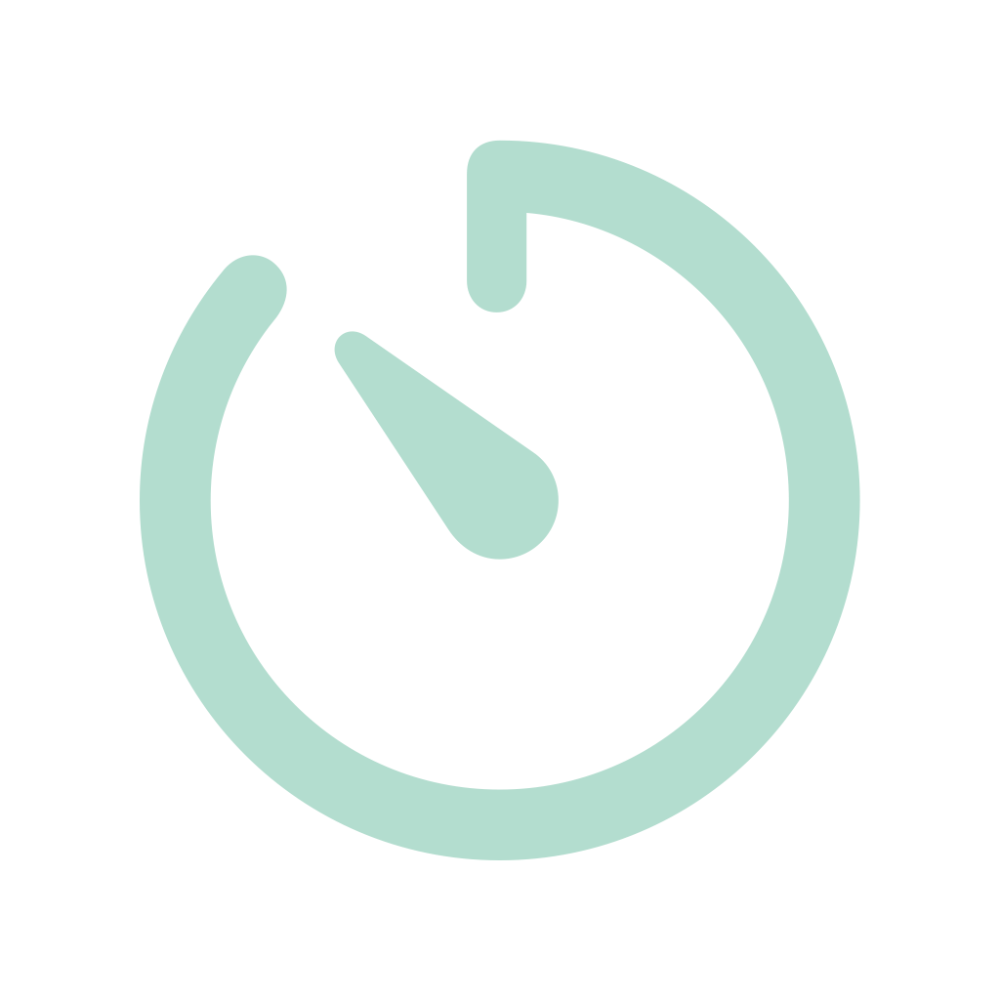
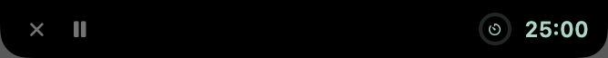
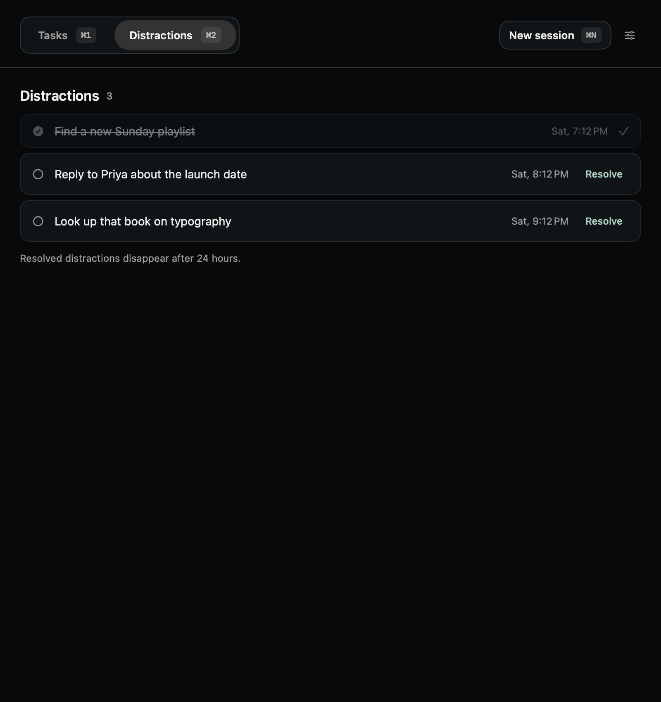
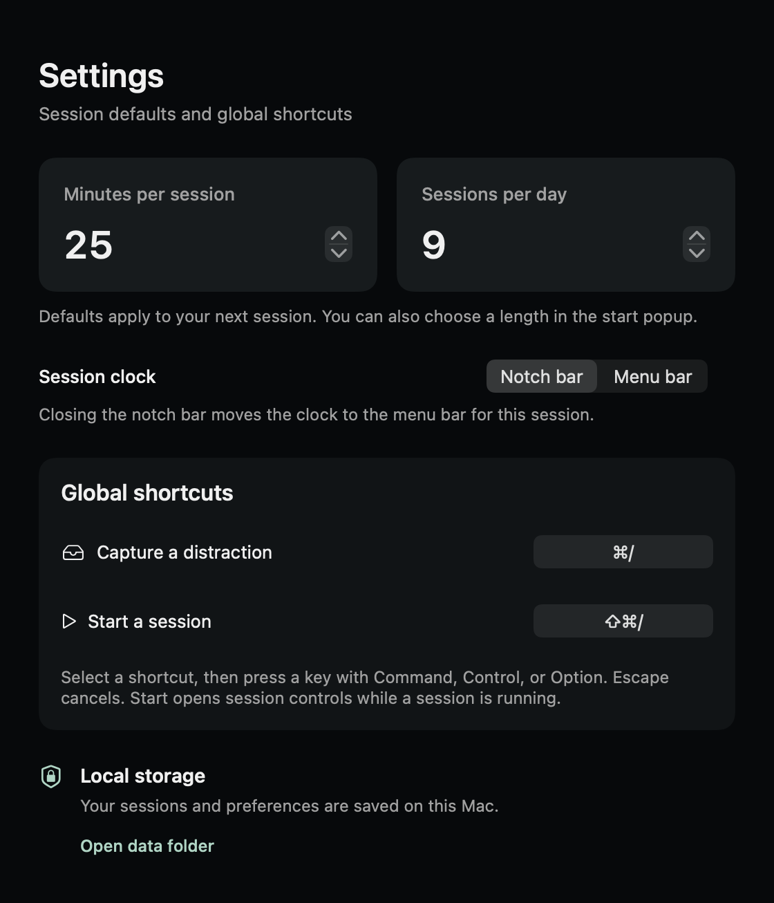
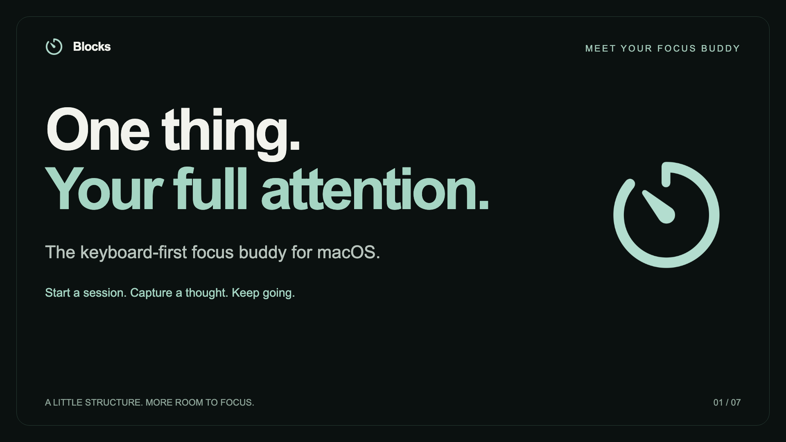

<div align="center">



# Blocks

**The keyboard-first focus buddy for macOS.**

Choose one thing to work on. Capture whatever pulls at you. Keep showing up.

No blocking · no monitoring · no accounts · no network · no TCC permissions


</div>

## Focus, without the ceremony

- **Start from anywhere.** Press `⇧⌘/`, name your task, and hit Return. Or use `↑` / `↓` to choose a captured distraction and work on it.
- **Capture, don’t chase.** Press `⌘/`, write down the thought, and hit Return to get back to your work.
- **Set your own rhythm.** Sessions default to 25 minutes. Set a default from 1–180 minutes in Settings, or override it for one session from the start strip.
- **Adjust without starting over.** Open the running strip to pause/resume, add 25 minutes, show/hide the notch bar, or abandon the session with an optional reason.
- **Finish quietly.** At zero, Blocks offers 25 more minutes for five minutes, then saves automatically. No sound, no window taking focus, no forced break.
- **See where time went.** Tasks shows day, seven-day, and thirty-day focus history, daily bars, project breakdowns, and a session timeline. Partial sessions count too.

## A session in snapshots

These are native SwiftUI previews generated from the current app with sample data using [`scripts/preview.sh`](scripts/preview.sh).

### Capture a thought


The capture strip appears beneath the notch with the field focused, including over fullscreen apps. Type a thought and press Return. Unresolved distractions stay until you resolve them; resolved ones remain crossed out for 24 hours, then leave the list. Starting a session from a captured distraction resolves it too.

### Stay with the same session


Press `⇧⌘/` during a running or paused session. Use `↑` / `↓` and Return to pause/resume, extend, toggle the notch bar, or abandon. Abandon opens an optional reason field; Return submits and Escape returns to the options. To start different work, abandon first.

Both timer popups show remaining time, total planned time including extensions, and a progress ring. The clock lives in the notch bar or the menu bar, according to Settings. Closing the notch bar moves it to the menu bar for that session.



Pausing from the strip or notch simply holds the clock. The menu’s **Pause…** action records a reason: one reasoned pause is allowed per session, and a second resets the session. Sleep suspends elapsed time without spending that pause. Quitting or crashing preserves remaining time; time while Blocks is closed is not charged.

### Finish, or keep going


At zero, the menu bar reads **Done** and the notch shows a checkmark. **Extend 25 minutes** continues the same session; **Finish now** saves immediately. Ignoring the offer saves after five minutes. The offer does not charge focus time. Starting another session also files the finished one; quitting during the offer preserves it for finalization on relaunch. The finished-session Extend button has no dedicated shortcut.

### See your focused time


Choose Day, 7 days, or 30 days. Navigate earlier periods, filter by project, or click a daily bar or project total to narrow the history. Totals include partial sessions and exclude paused time; sessions are grouped by their end date.

Each session belongs to its own task. Extending adds time to that session; it does not create another attempt. Marking a task done is separate from finishing its session. Retagging a task moves its sessions in reports while preserving the original project snapshot on disk.



Tasks (`⌘1`) and Distractions (`⌘2`) are the two review tabs. There is no Archive page.

## Shortcuts and settings

| Shortcut | Action |
| --- | --- |
| `⌘/` | Capture a distraction from any app |
| `⇧⌘/` | Start a session, or open controls for the current session |
| `↑` / `↓` / `↩` | Navigate and select in the start/running strips |
| `Esc` | Dismiss a strip, or go back from its optional reason field |
| `⌘1` / `⌘2` | Tasks / Distractions in the review window |
| `⌘[` / `⌘]` | Previous / next period in Tasks |
| `⌘,` | Open Settings |



Settings controls the default session length, daily session target, clock location, and the two global shortcuts. A one-session length override never changes the default. The start strip also offers recent projects and lets you name a new one.

## Install from source

Requires **macOS 14+** and Apple's Command Line Tools (`xcode-select --install`). No Xcode or developer account is needed.

```sh
git clone https://github.com/shubhamgrg04/blocks.git
cd blocks
./build.sh
```

This builds a release binary, renders the icon, assembles and self-signs `dist/Blocks.app`, installs it to `/Applications`, and launches it. Quit any running instance before rebuilding.

The first build creates a **Blocks Local Code Signing** identity in your login keychain, so macOS may ask you to authenticate. Later builds reuse it; ad-hoc signing is never used. Set `BLOCKS_SIGNING_IDENTITY` to use an existing certificate, or run `./build.sh --no-install` to build without installing.

Upgrading from **Park**: quit it first. Blocks copies `~/Library/Application Support/Park/` on first launch, leaving the original as a backup. Existing Blocks data is never overwritten.

## Your data

The app stores everything locally in `~/Library/Application Support/Blocks/`:

| File | Contents |
| --- | --- |
| `state.json` | Live checkpoint, tasks, project tags, preferences, and pending writes |
| `blocks.jsonl` | Completed, abandoned, and reset session records |
| `parking.jsonl` | Distraction events; the original filename is retained for compatibility |
| `intents.jsonl` | Retired queue events; no longer written |

Records use ISO 8601 UTC timestamps and append-only logs, deduplicated by ID on recovery. Unreadable data is preserved and reported; save failures suspend progress and show an error. Back up this folder before manual repairs.

Older completed records use planned duration; older partial records estimate focus time from timestamps and pauses when charged time was not recorded.

## Product Hunt launch video

[](launch-video/README.md)

The editable [Remotion project](launch-video/) contains a caption-led, 1080p launch video built from these native previews. See its [README](launch-video/README.md) for the scene list, asset refresh, preview, and MP4 export commands.

## Development

```sh
./test.sh             # Foundation-only core checks
./scripts/smoke.sh    # app persistence and session-length checks
./scripts/preview.sh  # regenerate native screenshots with isolated sample data
```

| Path | Purpose |
| --- | --- |
| [Sources/BlocksCore/](Sources/BlocksCore/) | Models and storage |
| [Sources/Blocks/](Sources/Blocks/) | SwiftUI surfaces, overlays, hotkeys, and brand |
| [SPEC.md](SPEC.md) | Behavior and acceptance checks; historical sections retain earlier decisions |
| [CONTEXT.md](CONTEXT.md) | Domain vocabulary |
| [docs/design/](docs/design/README.md) · [docs/adr/](docs/adr/) | Visual system and design decisions |
| [launch-video/](launch-video/) | Remotion launch video source and reproducible assets |

The notch timer, menu bar clock, global shortcuts, and multi-display behavior still need visual checks on real hardware.

## Branding

The native **timer** symbol is the Blocks brand mark, matching the menu bar and session surfaces. [Brand.swift](Sources/Blocks/Brand.swift) renders it in the product’s mint color; the app icon uses the same mark on its dark canvas. Run `./scripts/brand.sh` to regenerate the shared logo assets. Bundle identifier: `local.blocks.focus`.
