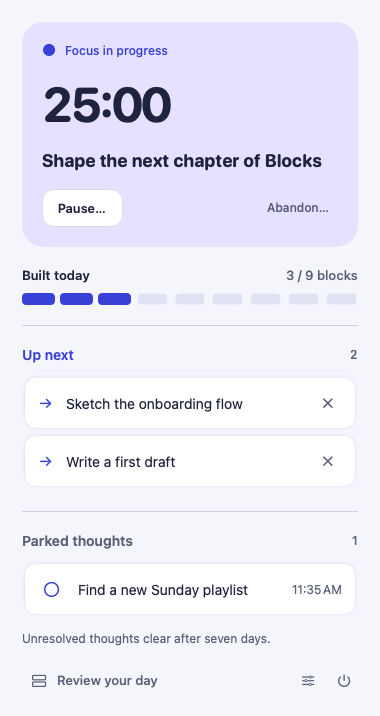
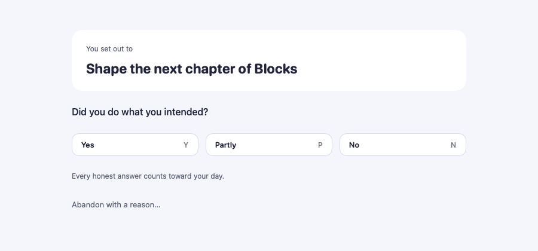

<div align="center">


# Blocks

**A macOS menu bar app for focused work.**
Declare one intent, park distractions instead of acting on them, and answer honestly at the boundary.

No blocking · no monitoring · no accounts · no network · no TCC permissions

<br>


&nbsp;&nbsp;


</div>

## How it works

- **One intent per block.** 25 minutes, one line of text naming what the time is for.
- **Park, don't chase.** A distraction gets captured in a few words from anywhere — writing it down is what makes it safe to not do it now.
- **Answer honestly.** At the boundary Blocks asks whether you did the thing. *No* counts exactly as much as *Yes*; what's counted is time served honestly.
- **No break.** Blocks returns straight to idle, or offers the next intent you queued.

## Install

Requires macOS 14+ and Apple's Command Line Tools (`xcode-select --install`). No Xcode, no developer account.

```sh
./build.sh
```

Builds a release binary, renders the icon, assembles and self-signs `dist/Blocks.app`, installs it to `/Applications`, and launches it.

The first build creates a **Blocks Local Code Signing** identity in your login keychain, so macOS may ask you to authenticate — a keychain dialog, not an Accessibility grant. Later builds reuse it; ad-hoc signing is never used. Set `BLOCKS_SIGNING_IDENTITY` to use a certificate you already have, or pass `--no-install` to build the bundle without installing it.

Quit any running instance before rebuilding.

Upgrading from **Park**: quit it first, and Blocks copies `~/Library/Application Support/Park/` across on first launch, leaving the original as a backup. Existing Blocks data is never overwritten.

## Daily use

| Shortcut | Does |
| --- | --- |
| `⌘/` | Park a thought — over any app or fullscreen window, field already focused |
| `⇧⌘/` | Start a block; during one, queue an intent for later |
| `⌘,` | Settings — block length, daily target, both shortcuts |
| `Y` `P` `N` | Answer the honesty check |

<div align="center">

</div>

The remaining time sits in the menu bar itself, not behind a click: bare `mm:ss` while a block runs, greyed beside a pause glyph when it's paused, and orange for the last 30 seconds, when a sound plays too. Pausing takes a typed reason and there's one per block; a second stop resets it. **Abandon…** ends a block early, on the record.

<div align="center">

</div>

Parked thoughts sit in the popover and clear themselves after seven days. Queued intents sit above them under **Up next**, never expire, and are offered as suggestions at the next boundary — `↑`/`↓` picks one, typing something else ignores them.

**Review** holds the rest: the week's blocks, today's outcomes, and your live lists, with resolved thoughts and removed intents on an **Archive** tab where both can be restored.

<div align="center">

</div>

Sleep suspends elapsed time without spending your pause. Quitting or crashing preserves the remaining time — time while Blocks was gone is never charged.

## Your data

Everything is local, in `~/Library/Application Support/Blocks/`:

| File | Holds |
| --- | --- |
| `state.json` | Live checkpoint — current phase, preferences, queued intents, pending writes |
| `blocks.jsonl` | One record per completed, abandoned, or reset block |
| `parking.jsonl` | Parked-thought events — resolved, expired, restored |
| `intents.jsonl` | Queue events — intents removed and restored |

Append-only, ISO 8601 UTC, deduplicated by ID so a crash mid-write loses nothing. Unreadable data is preserved and reported rather than silently replaced; a save failure suspends progress and shows an error. Back this folder up before repairing anything by hand.

## Development

```sh
./test.sh            # Foundation-only core checks (no XCTest needed)
./scripts/preview.sh # regenerate the screenshots in Resources/Previews
```

| Path | |
| --- | --- |
| [Sources/BlocksCore/](Sources/BlocksCore/) | Models and storage — the pure, tested core |
| [Sources/Blocks/](Sources/Blocks/) | SwiftUI surfaces, overlays, hotkeys, brand |
| [SPEC.md](SPEC.md) | What the app does, in full |
| [CONTEXT.md](CONTEXT.md) | The vocabulary it's built on |
| [docs/design/](docs/design/README.md) · [docs/adr/](docs/adr/) | Visual system · decisions and their costs |

Fullscreen overlays, the menu bar clock, and multi-display behavior need a visual pass on real hardware; the core checks can't establish them. SPEC.md carries the acceptance script.

## Branding

Three rounded bricks form a compact **B**, drawn once in [Sources/Blocks/Brand.swift](Sources/Blocks/Brand.swift) and used in two places: the menu bar template image, which adapts to its background, and the application icon that `build.sh` renders from the same source. The app's own surfaces carry no logo — they lead with your intent instead. Bundle identifier `local.blocks.focus`.
